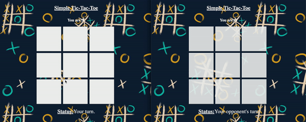

# Simple Tic-Tac-Toe Game

This is a simple implementation of the classic Tic-Tac-Toe game using Node.js for the server-side logic and vanilla JavaScript for the client-side interaction. The game follows a client-server architecture, where the server manages the game state and communication between players, and the clients handle the user interface.

## Game Structure

The game consists of the following entities:

1. **Server (`server.js`):** This file sets up the Node.js server using Express.js and Socket.io. It handles client connections, serves the static files (HTML, CSS, JavaScript), and manages game logic using `game.js`.

2. **Game Logic (`game.js` , `gameLogic.js`):** These file contains the logic for managing the game state, including player moves, win conditions.

3. **Client (`index.html`, `script.js`, `styles.css`):** These files define the user interface for the game. `index.html` contains the HTML structure, `script.js` handles client-side interactions and Socket.io events, and `styles.css` provides the styling for the UI.

## Basic Flow

1. **Client Connection:** When a player connects to the server, the server assigns them a symbol ('X' or 'O') and waits for an opponent.

2. **Game Initialization:** Once two players are connected, the server starts the game and notifies both players of their symbols.

3. **Gameplay:** Players take turns making moves by clicking on the game board. Each move is sent to the server, which validates it and updates the game state accordingly.

4. **Win Condition:** After each move, the server checks for a win condition by examining the current state of the game board. If a player has won or the game ends in a draw, the server sends a "game.over" event to the clients.

## Win Condition Checking

The server checks for the win condition after each move by examining all possible winning combinations:

- Rows: [0, 1, 2], [3, 4, 5], [6, 7, 8]
- Columns: [0, 3, 6], [1, 4, 7], [2, 5, 8]
- Diagonals: [0, 4, 8], [2, 4, 6]

If any of these combinations contain three matching symbols ('X' or 'O'), the game is won.

## How to Run the Game

### Server Side

1. Clone the repository to your local machine.
2. Navigate to the project directory in your terminal.
3. Install dependencies using `npm install`.
4. Create a `.env` file and specify the desired port (e.g., `PORT=8080`).
5. Run the server using `npm start`.

### Client Side

1. Open a web browser.
2. Enter the server address in the address bar (e.g., `http://localhost:8080`).
3. Play the game by clicking on the game board squares.